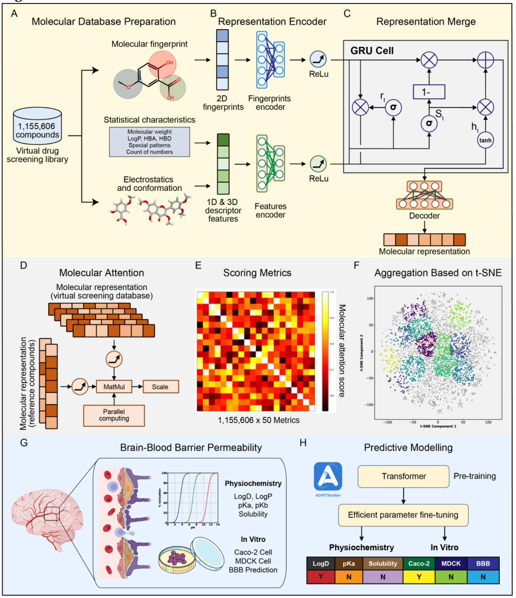

# DeepNAE

## AI-driven Platform for Identifying mTOR-independent Autophagy Enhancers for Alzheimer's Disease Therapy



## Overview
DeepNAE (Neuroprotective Autophagy Enhancer) identifies blood-brain barrier (BBB)-permeable, mTOR-independent autophagy enhancers for neurodegenerative disorders, particularly Alzheimer's disease. By targeting non-mTOR pathways, DeepNAE offers a more selective approach with reduced off-target effects.

## Online Service
Access our platform without local installation:
- [DeepDrugDiscovery Platform](https://deepdrugdiscovery.mindrank.ai/)

Features include:
- Complete functionality without local GPU resources
- Integrated ADMET prediction
- User-friendly interface
- Secure storage for results and custom libraries

## Key Features

### mTOR-independent Compound Screening
- Identifies compounds enhancing autophagy through non-mTOR pathways
- Reduces off-target effects associated with mTOR inhibition
- Uses GPU-accelerated screening for rapid analysis

### Blood-Brain Barrier Penetration and ADMET Prediction
- Predicts BBB penetration capabilities of candidate compounds
- Prioritizes compounds with optimal CNS penetration
- Leverages [ADMET prediction service](https://admet.mindrank.ai/) for comprehensive profiling

## Installation

```bash
# Clone the repository
git clone git@github.com:mindrank-ai/DeepNAE.git
cd DeepNAE

# Create and activate virtual environment
python -m venv venv
source venv/bin/activate  # On Windows: venv\Scripts\activate

# Install dependencies
pip install -r requirements.txt
```

## Requirements
- Python 3.8+
- PyTorch 1.10+
- RDKit 2022.03+
- CUDA 11.2+ (for GPU acceleration)
- NumPy 1.20+
- Pandas 1.4+
- Scikit-learn 1.0+
- Requests 2.28+
- python-dotenv 0.19+

## License
See the LICENSE file for details.